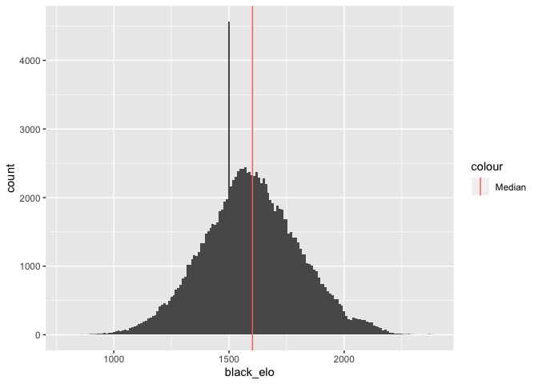
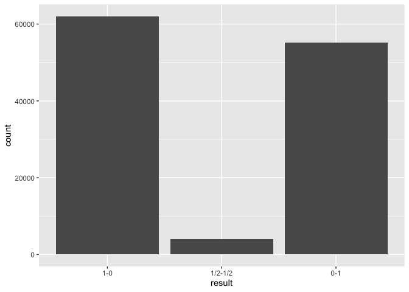
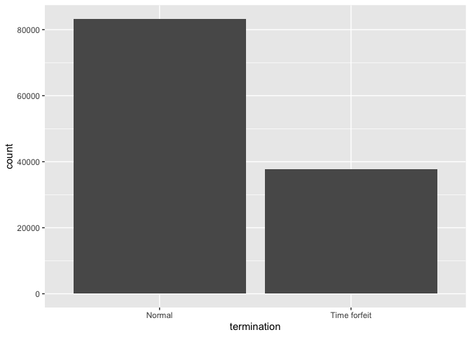
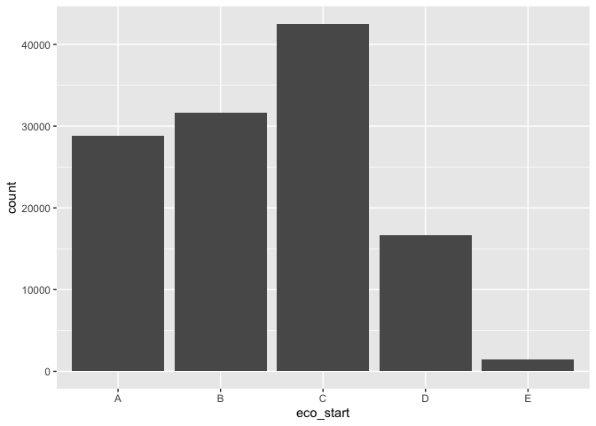

C01 Games EDA
================
Connor Quin
2020-01-29

``` r
# Libraries
library(tidyverse)

# Parameters
rds_path <- here::here("data/games.rds")

eco_levels = c("A", "B", "C", "D", "E")
#===============================================================================
```

Here is the first draft of my initial C01 analysis on lichess’s database
chess data. As a first run, I’m using data from Lichess’s January 2013
database. The raw PGN file is 16.1 MB, with 121,332 games.

To start, let’s read in this data and perform any EDA modifications

``` r
games <-
  read_rds(rds_path)

summary(games)
```

    ##     white             white_elo      opening          termination       
    ##  Length:121114      Min.   : 782   Length:121114      Length:121114     
    ##  Class :character   1st Qu.:1474   Class :character   Class :character  
    ##  Mode  :character   Median :1602   Mode  :character   Mode  :character  
    ##                     Mean   :1606                                        
    ##                     3rd Qu.:1739                                        
    ##                     Max.   :2403                                        
    ##      result         black             black_elo    time_control      
    ##  1-0    :62009   Length:121114      Min.   : 789   Length:121114     
    ##  1/2-1/2: 3966   Class :character   1st Qu.:1463   Class :character  
    ##  0-1    :55139   Mode  :character   Median :1588   Mode  :character  
    ##                                     Mean   :1596                     
    ##                                     3rd Qu.:1732                     
    ##                                     Max.   :2386                     
    ##      eco               event           white_elo_diff    
    ##  Length:121114      Length:121114      Min.   :-1257.00  
    ##  Class :character   Class :character   1st Qu.: -112.00  
    ##  Mode  :character   Mode  :character   Median :    8.00  
    ##                                        Mean   :   10.15  
    ##                                        3rd Qu.:  130.00  
    ##                                        Max.   : 1257.00  
    ##           time_type    
    ##  Bullet        :32982  
    ##  Blitz         :46249  
    ##  Classical     :41703  
    ##  Correspondence:  180  
    ##                        
    ## 

First off, let’s do some 1D visualizations to get a sense of how the
continuous variables look

``` r
# Distribution of white ratings
games %>% 
  ggplot(mapping = aes(x = white_elo)) +
  geom_histogram(binwidth = 10) +
  geom_vline(aes(xintercept = median(games$white_elo), color = "Median"))
```

<!-- -->

``` r
# Distribution of changes to white ratings
games %>% 
  ggplot(mapping = aes(x = white_elo_diff)) +
  geom_histogram(binwidth = 10) +
  geom_vline(aes(xintercept = median(games$white_elo_diff), color = "Median"))
```

<!-- -->

``` r
# Distribution of black ratings
games %>% 
  ggplot(mapping = aes(x = black_elo)) +
  geom_histogram(binwidth = 10) +
  geom_vline(aes(xintercept = median(games$white_elo), color = "Median"))
```

<!-- -->

Some thoughts:

  - Note the odd spike at `white_elo = 1500`. This is because Lichess
    assigns newly signed-up members an initial rating of 1500

  - As a median, this dataset saw the white players slightly higher than
    their black counterparts.

Now for the discrete variables:

``` r
# Frequency of time types:
games %>% 
  ggplot(mapping = aes(x = time_type)) +
  geom_bar()
```

<!-- -->

``` r
# Frequency of results:
games %>% 
  ggplot(mapping = aes(x = result)) +
  geom_bar()
```

<!-- -->

``` r
# Frequency of termination:
games %>% 
  ggplot(mapping = aes(x = termination)) +
  geom_bar()
```

<!-- -->

``` r
# Opening Frequencies:
games %>%
  transmute(
    eco_start = factor(substring(eco, 1, 1), levels = eco_levels)
  ) %>% 
  ggplot(mapping = aes(x = eco_start)) +
  geom_bar()
```

<!-- -->

Thoughts:

  - The game has a good mix of bullet, blitz, and classical game.
    Correspondence is much less represented (n = 180) and might as well
    be removed later perhaps.

  - Compared to top level over-the-board chess, there are very few draws
    here. White also wins more often than black.

  - Most games are terminated on the board, but a healthy amount are
    also won/lost on time.

  - Across all these games, C is the most common ECO code, followed by
    B, A, D, and E.
