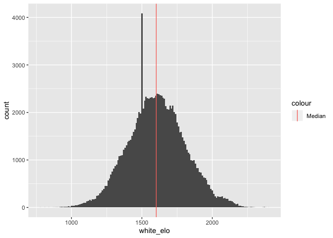
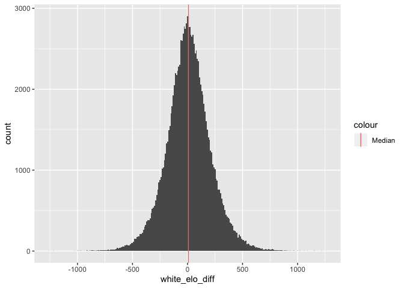
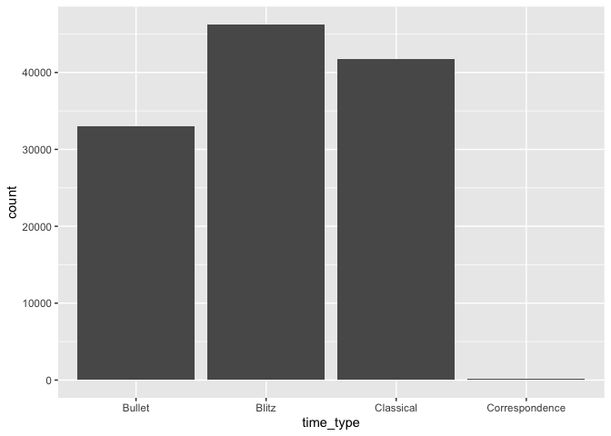

C01 Games EDA
================
Connor Quin
2020-01-29

``` r
# Libraries
library(tidyverse)

# Parameters
rds_path <- here::here("data/games.rds")
#===============================================================================

# Code
```

Here is the first draft of my initial C01 analysis on lichess’s database
chess data. As a first run, I’m using data from Lichess’s January 2013
database. The raw PGN file is 16.1 MB, with 121,332 games.

To start, let’s read in this data

``` r
games <-
  read_rds(rds_path)

glimpse(games)
```

    ## Observations: 121,114
    ## Variables: 11
    ## $ white          <chr> "BFG9k", "Desmond_Wilson", "Kozakmamay007", "Naitero_N…
    ## $ white_elo      <int> 1639, 1654, 1643, 1824, 1765, 1477, 1541, 1765, 1445, …
    ## $ opening        <chr> "French Defense: Normal Variation", "Queen's Pawn Game…
    ## $ termination    <chr> "Normal", "Normal", "Normal", "Normal", "Normal", "Tim…
    ## $ result         <chr> "1-0", "1-0", "1-0", "0-1", "0-1", "1-0", "0-1", "1-0"…
    ## $ black          <chr> "mamalak", "savinka59", "VanillaShamanilla", "800", "N…
    ## $ black_elo      <int> 1403, 1919, 1747, 1973, 1815, 1487, 1500, 1752, 1169, …
    ## $ time_control   <chr> "600+8", "480+2", "420+17", "60+1", "60+1", "300+3", "…
    ## $ eco            <chr> "C00", "D04", "C50", "B12", "C00", "B00", "C53", "C20"…
    ## $ event          <chr> "Rated Classical game", "Rated Classical game", "Rated…
    ## $ white_elo_diff <int> 236, -265, -104, -149, -50, -10, 41, 13, 276, 94, 100,…

``` r
summary(games)
```

    ##     white             white_elo      opening          termination       
    ##  Length:121114      Min.   : 782   Length:121114      Length:121114     
    ##  Class :character   1st Qu.:1474   Class :character   Class :character  
    ##  Mode  :character   Median :1602   Mode  :character   Mode  :character  
    ##                     Mean   :1606                                        
    ##                     3rd Qu.:1739                                        
    ##                     Max.   :2403                                        
    ##     result             black             black_elo    time_control      
    ##  Length:121114      Length:121114      Min.   : 789   Length:121114     
    ##  Class :character   Class :character   1st Qu.:1463   Class :character  
    ##  Mode  :character   Mode  :character   Median :1588   Mode  :character  
    ##                                        Mean   :1596                     
    ##                                        3rd Qu.:1732                     
    ##                                        Max.   :2386                     
    ##      eco               event           white_elo_diff    
    ##  Length:121114      Length:121114      Min.   :-1257.00  
    ##  Class :character   Class :character   1st Qu.: -112.00  
    ##  Mode  :character   Mode  :character   Median :    8.00  
    ##                                        Mean   :   10.15  
    ##                                        3rd Qu.:  130.00  
    ##                                        Max.   : 1257.00

``` r
# Some initial plots:

# Distribution of white ratings
games %>% 
  ggplot(mapping = aes(x = white_elo)) +
  geom_histogram(binwidth = 10) +
  geom_vline(aes(xintercept = median(games$white_elo), color = "Median"))
```

<!-- -->

``` r
# Distribution of changes to white ratings
games %>% 
  ggplot(mapping = aes(x = white_elo_diff)) +
  geom_histogram(binwidth = 10) +
  geom_vline(aes(xintercept = median(games$white_elo_diff), color = "Median"))
```

<!-- -->

``` r
# Initial plots: how do opening codes look?

# Among all games
games %>%
  transmute(
    eco_start = substring(eco, 1, 1),
    above_1700 = white_elo >= 1700 & black_elo >= 1700) %>%
  count(eco_start, above_1700) %>%
  group_by(above_1700) %>% 
  mutate(
    prop = n / sum(n)
  ) %>% 
  ggplot(mapping = aes(x = eco_start, y = prop)) +
  geom_col(mapping = aes(fill = above_1700)) +
  facet_grid(cols = vars(above_1700))
```

<!-- -->
